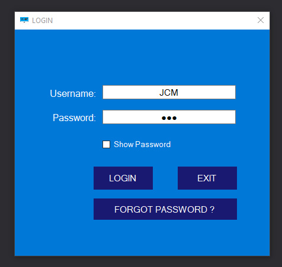
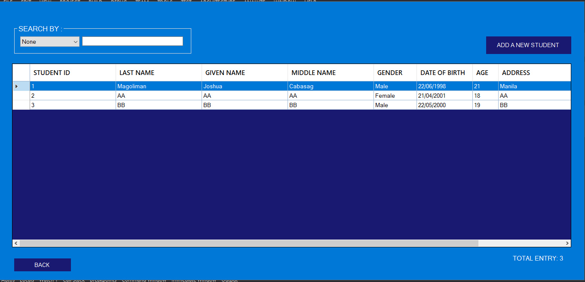
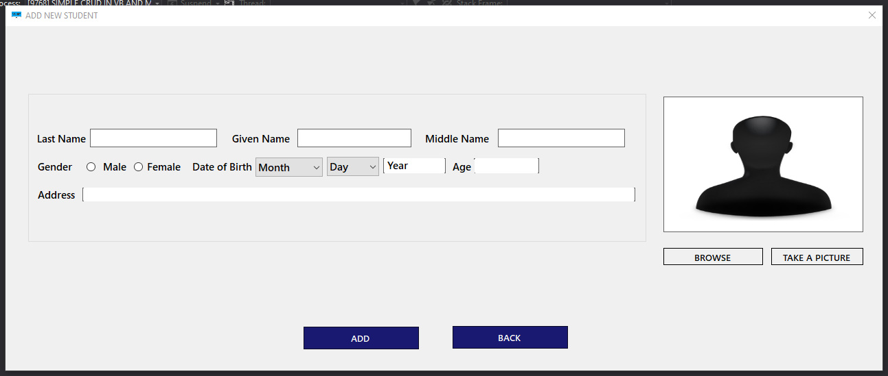
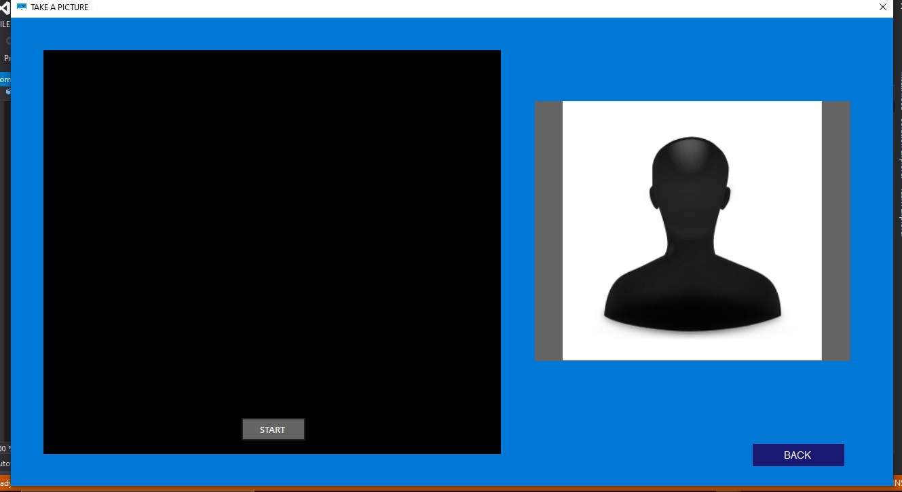
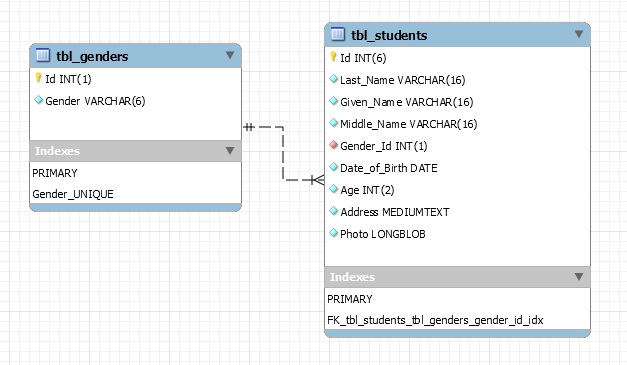

# MY SIMPLE CRUD IN VB.NET AND MYSQL

* Purpose: My Project
* Programming Language: Visual Basic.Net
* Target Framework: .Net Framework 4.6.1
* IDE: MS Visual Studio 2012
* Backend Database: MySQL
* MySQL GUI Tool: MySQL Workbench
* Type of Application: Desktop Application (Windows Forms Application)
  
<h2> User Interface Screenshots </h2> 
  
  
  
  
  
  
  
  
  
	
  
	  
  
				  
  
  
  
  
<h2> Database Design Screenshot </h2> 
  
  